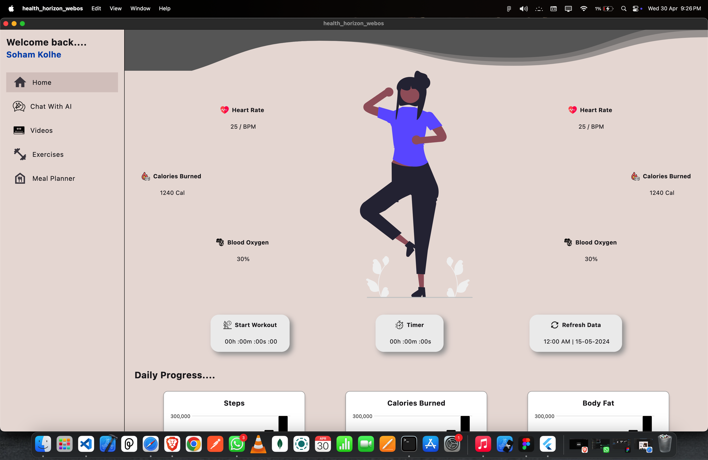

# Health Horizon

**Health Horizon** is a cross-platform health and fitness application that connects with mobile devices, fitness bands, and smartwatches to provide real-time health data and insights. It tracks user activity, progress, and offers features such as AI-powered suggestions, workout tutorials, exercises, and a smart meal planner. The app supports Web, webOS, macOS, Windows, and Linux platforms.

---

## 🚀 Setup & Run Instructions

### 1. Clone the Repository

```bash
git clone https://github.com/sohamkolhe9829/health_horizon_webos.git
cd health-horizon
```

### 2. Install Dependencies

```bash
# For Flutter
flutter pub get
```

### 3. Run the App

#### Web

```bash
flutter run -d chrome
```

#### Windows/macOS/Linux

```bash
flutter run -d windows   # Replace with macos or linux as needed
```

#### WebOS

> WebOS setup instructions go here (e.g., using Enact or custom packaging tools).

---

## ⚙️ Dependencies & Configurations

- [Flutter SDK](https://flutter.dev/docs/get-started/install)
- Platform SDKs:
  - Android Studio (for Android)
  - Xcode (for iOS/macOS)
- Core Plugins:
  - `flutter_blue_plus` – Bluetooth connectivity
  - `health` – Health data access
  - `video_player` – Video tutorials
  - `provider` – State management
  - `http` – API requests
- AI Integrations :
  - Gemini API
- Permissions:
  - Bluetooth, activity recognition, storage, internet access

---

## 📸 Screenshots / Demo

### Home Dashboard



---

## 📄 License

This project is licensed under the [MIT License](LICENSE).
